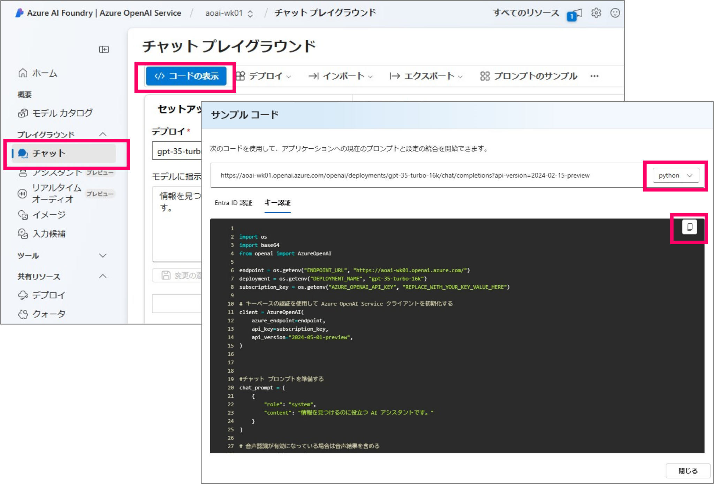

# aoai-infra-workshop-chatapp

## （別の方法）コマンドラインで疎通確認をする

チャットプレイグラウンドからサンプルのコードがダウンロードできますので、コマンドラインから簡単に実験することができます。



### STEP1 - Linux 環境の用意
OpenAI に接続可能な Linux 環境をご用意ください

- Linux の VM をデプロイして演習で作成した VNET に接続する
- ローカルのクライアントにを Linux にして（WSLでも可能）、演習の VNET に VPN GW 接続するなど

### STEP2 - Python のインストール

用意した Linux 環境にログインして、Python をインストールします。

- Python の開発環境を用意
``` bash
# apt を最新化します
$ sudo apt update
$ sudo apt upgrade

# 以下の Python のモジュールをインストールします
$ sudo apt install python3
$ sudo apt install python3-venv
$ sudo apt install python3-pip
```

### STEP3 - Python プログラムの編集

- プロジェクトフォルダの用意

``` bash
# プロジェクトフォルダの作成
$ mkdir testapp

# フォルダに移動
$ cd testapp
```

- お好みのエディタを起動し、チャットプレイグラウンドからコピーしたコードを貼り付けます。ここでは「キー認証」版をコピー＆ペーストします

``` bash
# エディタの起動。ファイル名は任意
$ vi testapp.py
```

- プログラムを編集して ```ENDPOINT_URL```,  ```DEPLOYMENT_NAME```, ```AZURE_OPENAI_API_KEY``` を設定します
- またお好きなプロンプト（質問事項）を以下のソースの様に追加してください

``` python
import os  
import base64
from openai import AzureOpenAI  

endpoint = os.getenv("ENDPOINT_URL", "<<ここにエンドポイントを指定する>>")  
deployment = os.getenv("DEPLOYMENT_NAME", "<<ここにデプロイしたモデル名を指定する>>")  
subscription_key = os.getenv("AZURE_OPENAI_API_KEY", "<<ここに AOAI のキーを指定する>>")  
# 以下の３つは使わないのでコメント
#search_endpoint = os.getenv("SEARCH_ENDPOINT", "")  
#search_key = os.getenv("SEARCH_KEY", "")  
#search_index = os.getenv("SEARCH_INDEX_NAME", "")  

# キーベースの認証を使用して Azure OpenAI Service クライアントを初期化する    
client = AzureOpenAI(  
    azure_endpoint=endpoint,  
    api_key=subscription_key,  
    api_version="2024-05-01-preview",
)

#チャット プロンプトを準備する。ここに好きな質問事項を設定します。
chat_prompt = [
    {
        "role": "system",
        "content": "情報を見つけるのに役立つ AI アシスタントです。"
    },
    {
        "role": "user",
        "content": "国産メインフレームはどのようにして開発されましたか？"
    }
]

# 音声認識が有効になっている場合は音声結果を含める  
messages = chat_prompt  
    
# 入力候補を生成する  
completion = client.chat.completions.create(  
    model=deployment,
    messages=messages,
    max_tokens=800,  
    temperature=0.7,  
    top_p=0.95,  
    frequency_penalty=0,  
    presence_penalty=0,
    stop=None,  
    stream=False
)

print(completion.to_json())  
```

### STEP4 - Python の開発環境を準備して、openai モジュールをインストールする

- 仮想環境を準備します
``` bash
# 仮想環境を作成
$ python3 -m venv .venv

# 仮想環境を起動
$ source ./.venv/bin/activate

# 仮想環境が起動するので、ここに openai をインストール
(.venv)$ pip install openai
```

### STEP5 - Python のプログラムを実行する

``` python
# 仮想環境を終了してしまっている場合は、再度、仮想環境を起動します
# $ source ./.venv/bin/activate

# プログラムの実行（応答の JSON が表示されるのが確認できると思います）
(.vent)$ python3 ./testapp.py
```

## (EOF)
