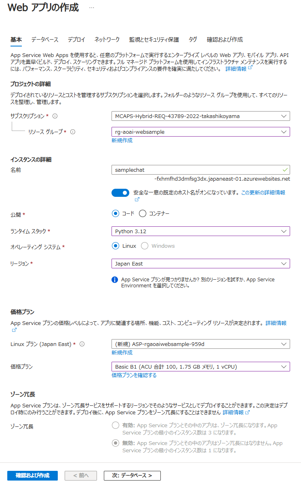

# aoai-infra-workshop-chatapp
このリポジトリには「インフラアーキテクト向け AOAI 設計考慮点ワークショップ」の演習で使用するプログラムが格納されています。

演習では、本来は以下のプログラムで動作確認します。
 - [sample-app-aoai-chatGPT](https://github.com/microsoft/sample-app-aoai-chatGPT)

しかし、こちらのリポジトリは改修が頻繁に行われており、正しく動作しないタイミングや、そもそも Web アプリをうまくデプロイできないケースがあります。
その様なケースにおいての回避策として、簡単な疎通用のサンプルアプリを用意しました。

## 動作確認手順

### はじめに

- 本演習で使用するサンプルプログラムは疎通確認だけを目的に作成されています。
実運用に耐えられるようには作成されておりません。

- 本サンプルプログラムは Azure OpenAI へのアクセスは API キー認証を使用します
元の演習では、Managed ID を使用した認証になっており、違いがありますのでご注意ください

### STEP1 - Web App リソースのデプロイ

- Azure Portal から [Web アプリ] を作成してください

- 以下のパラメータで作成します。
  - サブスクリプション - ご利用のサブスクリプションを指定します
  - リソースグループ - 任意です。既存のリソースグループでもいいですし、新規に作成したリソースグループでも大丈夫です。
  - 名前 - お好きな名前を付けてください。ただし、グローバルで一意である必要があります。
  - 公開 - [コード] を選択します
  - ランタイムスタック - [Python 3.12] を選択します
  - オペレーティングシステム - [Linux] を選択します
  - リージョン - 任意ですが、原則として AOAI をデプロイしたリージョンと同じにします
  - Linux プラン - 新規作成してください（名前等は任意）
  - 価格プラン - 任意です。
- その他のタブは既定のままで大丈夫です。
- 最後に「確認および作成]-[作成] をクリックします

