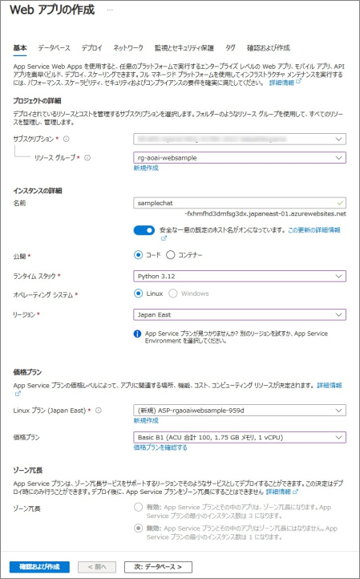
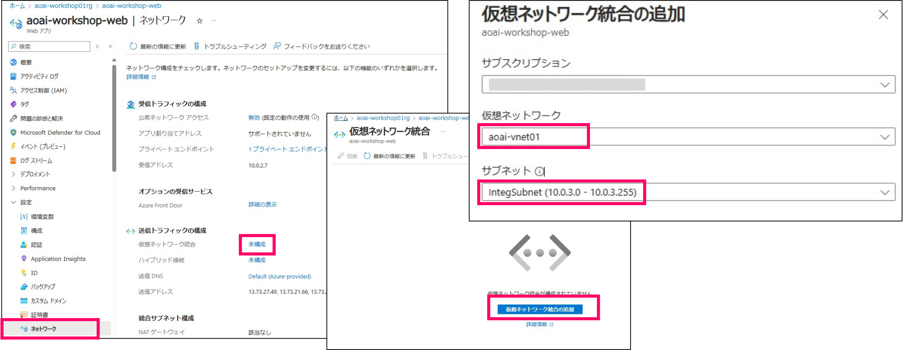
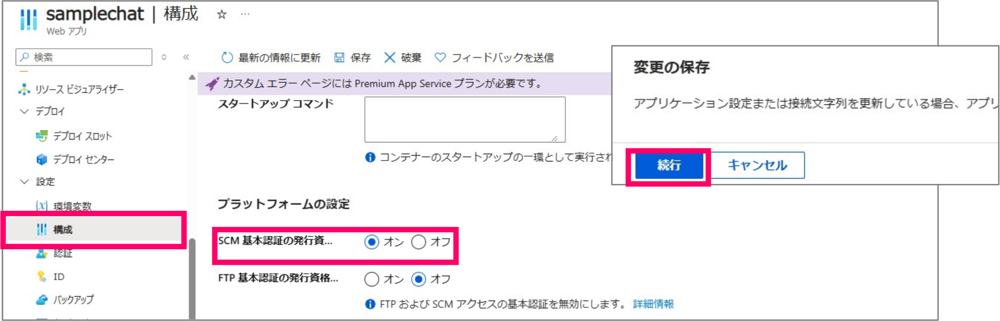
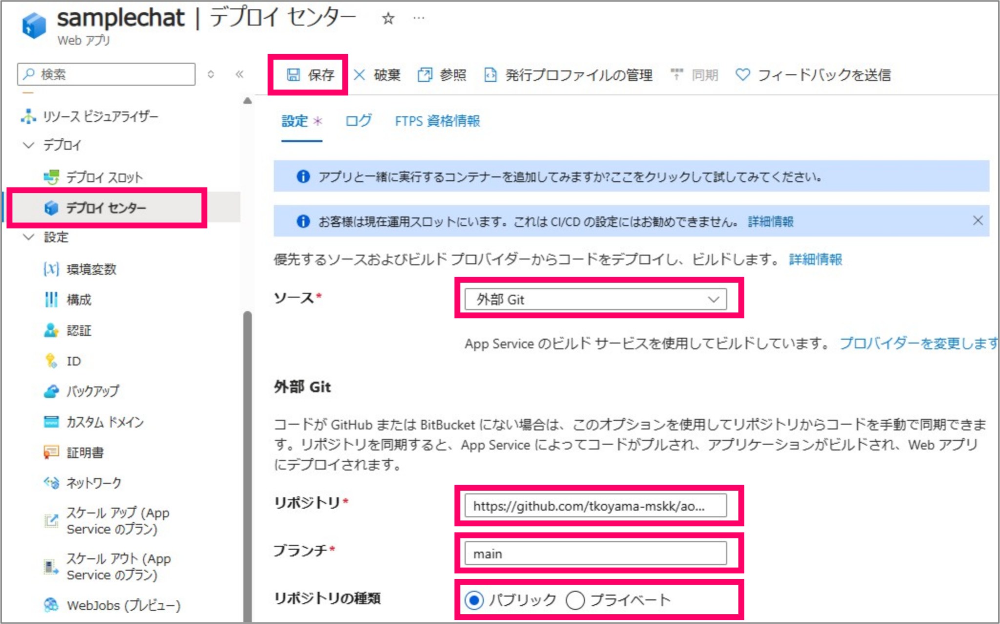
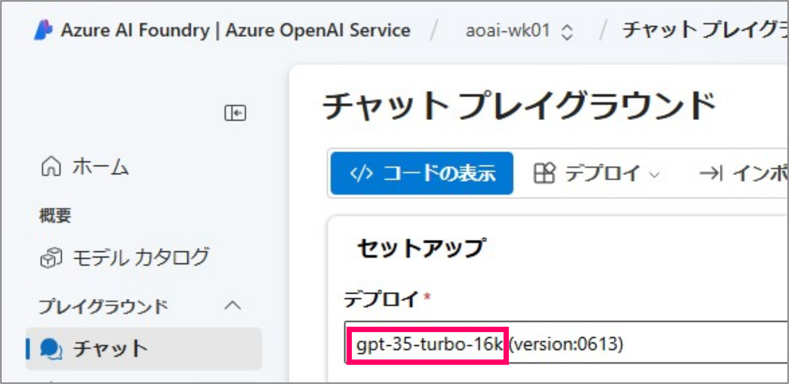
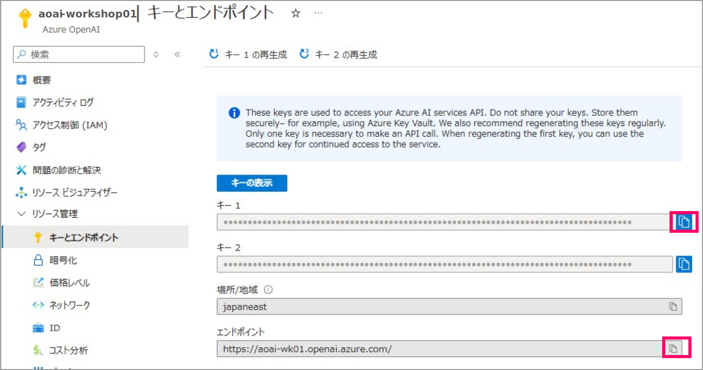
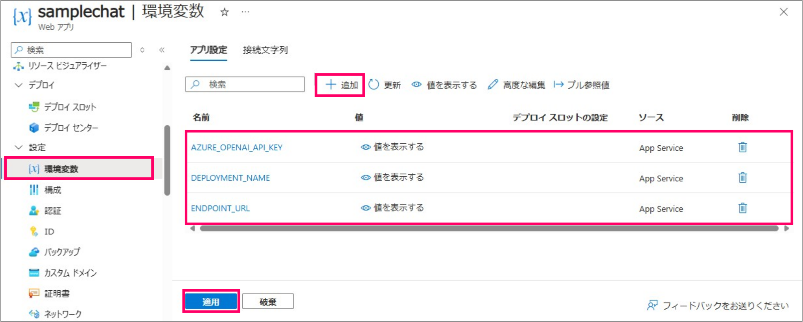
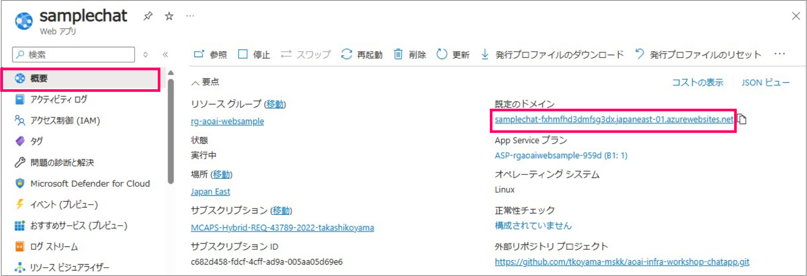
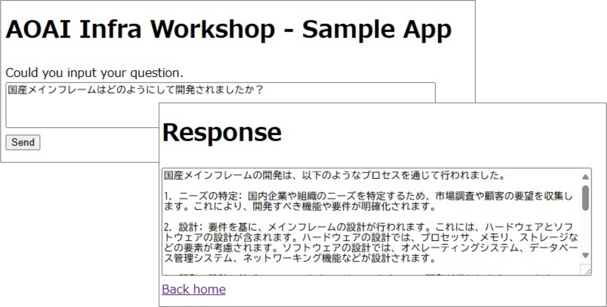
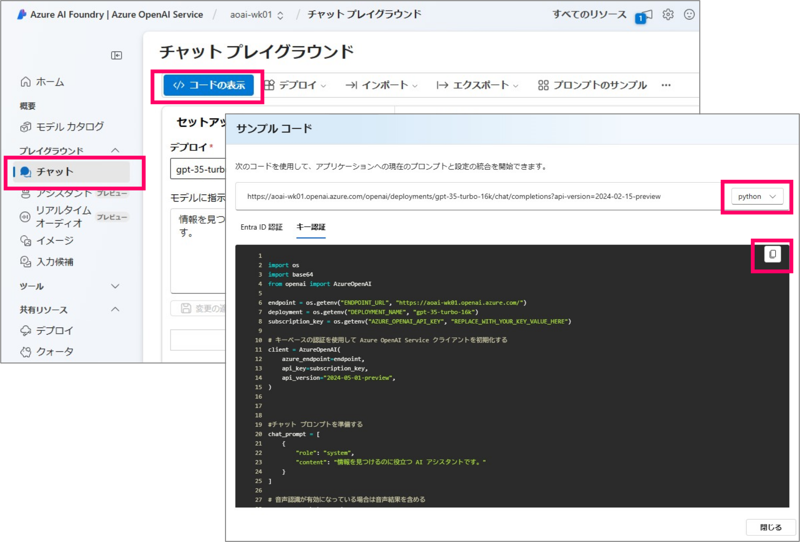

# aoai-infra-workshop-chatapp
このリポジトリには「インフラアーキテクト向け AOAI 設計考慮点ワークショップ」の演習で使用するプログラムが格納されています。

演習では、本来は以下のプログラムで動作確認します。
 - [sample-app-aoai-chatGPT](https://github.com/microsoft/sample-app-aoai-chatGPT)

しかし、こちらのリポジトリは改修が頻繁に行われており、正しく動作しないタイミングや、そもそも Web アプリをうまくデプロイできないケースがあります。
その様なケースにおいての回避策として、簡単な疎通用のサンプルアプリを用意しました。


## サンプル Web App による動作確認手順

### はじめに

- 本演習で使用するサンプルプログラムは疎通確認だけを目的に作成されています。
実運用に耐えられるようには作成されておりませんのでご注意ください

- 本サンプルプログラムは Azure OpenAI へのアクセスは API キー認証を使用します
元の演習では、Managed ID を使用した認証になっており、違いがありますのでご注意ください

### STEP1 - Web App リソースのデプロイ

- Azure Portal から [Web アプリ] を作成してください


- 以下のパラメータで作成します。
  - サブスクリプション - ご利用のサブスクリプションを指定します
  - リソースグループ - 任意です。既存のリソースグループでもいいですし、新規に作成したリソースグループでも大丈夫です。
  - 名前 - お好きな名前を付けてください。ただし、グローバルで一意である必要があります。
  - 公開 - [コード] を選択します
  - ランタイムスタック - [Python 3.12] を選択します
  - オペレーティングシステム - [Linux] を選択します
  - リージョン - AOAI をデプロイしたリージョンと同じにします
  - Linux プラン - 新規作成してください（名前等は任意）
  - 価格プラン - 任意です。
- その他のタブは既定のままで大丈夫です。
- 最後に「確認および作成]-[作成] をクリックします

### STEP2 - 仮想ネットワーク統合を有効にする


- デプロイした Web アプリ（App Service）のリソースに移動して、[ネットワーク] から「仮想ネットワーク統合」を構成します。

### STEP3 - アプリケーションをデプロイします
今回は「外部の Git」からの手動デプロイを利用します。最初に、SCM 基本認証をオンにしておく必要があります。

#### SCM 基本認証を有効にします

- Web アプリ（App Service）の [構成] から、[SCM 基本認証の発行資格情報] を [オン] にします。

#### 外部 Git を指定します


- Web アプリ（App Service）の [デプロイセンターから]、[ソース] に「外部 Git」を指定します
  - リポジトリは次を指定してください → https://github.com/tkoyama-mskk/aoai-infra-workshop-chatapp.git
  - ブランチは [main] と指定します
  - リポジトリの種類は [パブリック] です
- 最後に [保存] をクリックしてください
- そのまま暫くまちます。デプロイの進捗は [ログ] のタブから確認できます

### STEP4 - 環境変数を設定します

#### モデルの名前を控えます


- モデルの名前は、デプロイしたモデルの名前です。「Azure AI Foundry」のチャットプライグラウンドから確認できます。

#### キーとエンドポイントの値を控えます


- キーとエンドポイントは、Azure OpenAI の [キーとエンドポイント] から取得可能です

#### 環境変数を設定します
先ほど控えた値を環境変数に設定します


- Web アプリ（App Service）の [環境変数] から以下の３つの環境変数を追加してください
  - ```DEPLOYMENT_NAME``` - 「gpt-35-turbo-16k」などデプロイしたモデル名を指定します
  - ```ENDPOINT_URL``` - OpenAI のエンドポイント URL を指定します。
  - ```AZURE_OPENAI_API_KEY``` - OpenAI のキーを指定します。
- 最後に[適用]ボタン、[確認] をクリックします

### STEP5 - 動作確認
#### アプリの起動

- Web アプリ（App Service）の [概要] から [既定のドメイン]にある URL をクリックするとアプリが起動します

#### 動作確認

- テキストボックスに「国産メインフレームはどのようにして開発されましたか？」と入力すると結果が返ります。（すこし時間がかかります）


## （別の方法）コマンドラインで疎通確認をする

チャットプレイグラウンドからサンプルのコードがダウンロードできますので、コマンドラインから簡単に実験することができます。



### STEP1 - Linux 環境の用意
OpenAI に接続可能な Linux 環境をご用意ください

- Linux の VM をデプロイして演習で作成した VNET に接続する
- ローカルのクライアントにを Linux にして（WSLでも可能）、演習の VNET に VPN GW 接続するなど

### STEP2 - Python のインストール

用意した Linux 環境にログインして、Python をインストールします。

- Python の開発環境を用意
``` bash
# apt を最新化します
$ sudo apt update
$ sudo apt upgrade

# 以下の Python のモジュールをインストールします
$ sudo apt install python3
$ sudo apt install python3-venv
$ sudo apt install python3-pip
```

### STEP3 - Python プログラムの編集

- プロジェクトフォルダの用意

``` bash
# プロジェクトフォルダの作成
$ mkdir testapp

# フォルダに移動
$ cd testapp
```

- お好みのエディタを起動し、チャットプレイグラウンドからコピーしたコードを貼り付けます。ここでは「キー認証」版をコピー＆ペーストします

``` bash
# エディタの起動。プログラム名は任意
$ vi testapp.py
```

- プログラムを編集して ```ENDPOINT_URL```,  ```DEPLOYMENT_NAME```, ```AZURE_OPENAI_API_KEY``` を設定します
- またお好きなプロンプト（質問事項）を以下のソースの様に追加してください

``` python
import os  
import base64
from openai import AzureOpenAI  

endpoint = os.getenv("ENDPOINT_URL", "<<ここにエンドポイントを指定する>>")  
deployment = os.getenv("DEPLOYMENT_NAME", "<<ここにデプロイしたモデル名を指定する>>")  
subscription_key = os.getenv("AZURE_OPENAI_API_KEY", "<<ここに AOAI のキーを指定する>>")  
# 以下の３つは使わないのでコメント
#search_endpoint = os.getenv("SEARCH_ENDPOINT", "")  
#search_key = os.getenv("SEARCH_KEY", "")  
#search_index = os.getenv("SEARCH_INDEX_NAME", "")  

# キーベースの認証を使用して Azure OpenAI Service クライアントを初期化する    
client = AzureOpenAI(  
    azure_endpoint=endpoint,  
    api_key=subscription_key,  
    api_version="2024-05-01-preview",
)

#チャット プロンプトを準備する。ここに好きな質問事項を設定します。
chat_prompt = [
    {
        "role": "system",
        "content": "情報を見つけるのに役立つ AI アシスタントです。"
    },
    {
        "role": "user",
        "content": "国産メインフレームはどのようにして開発されましたか？"
    }
]

# 音声認識が有効になっている場合は音声結果を含める  
messages = chat_prompt  
    
# 入力候補を生成する  
completion = client.chat.completions.create(  
    model=deployment,
    messages=messages,
    max_tokens=800,  
    temperature=0.7,  
    top_p=0.95,  
    frequency_penalty=0,  
    presence_penalty=0,
    stop=None,  
    stream=False
)

print(completion.to_json())  
```

### STEP4 - Python の開発環境を準備して、openai モジュールをインストールする

- 仮想環境を準備します
``` bash
# 仮想環境を作成
$ python3 -m venv .venv

# 仮想環境を起動
$ source ./.venv/bin/activate

# 仮想環境が起動するので、ここに openai をインストール
(.venv)$ pip install openai
```

### STEP5 - Python のプログラムを実行する

``` python
# 仮想環境を終了してしまっている場合は、再度、仮想環境を起動します
# $ source ./.venv/bin/activate

# プログラムの実行（応答の JSON が表示されるのが確認できると思います）
(.vent)$ python3 ./testapp.py
```

## (EOF)
