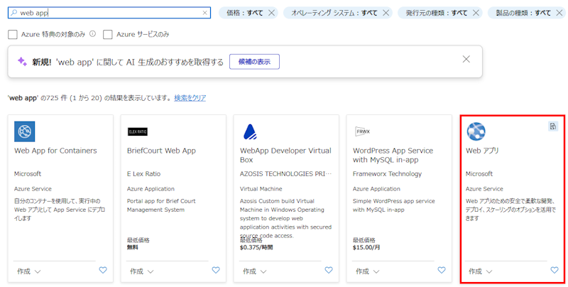

# aoai-infra-workshop-chatapp
このリポジトリには「インフラアーキテクト向け AOAI 設計考慮点ワークショップ」の演習で使用するプログラムが格納されています。

演習では、本来は以下のプログラムで動作確認します。
 - [sample-app-aoai-chatGPT](https://github.com/microsoft/sample-app-aoai-chatGPT)
しかし、こちらのリポジトリは改修が頻繁に行われており、正しく動作しないタイミングや、そもそも Web アプリをうまくデプロイできないケースがあります。
その様なケースにおいての回避策として、簡単な疎通用のサンプルアプリを用意しました。

## 動作確認手順

### はじめに

- 本演習で使用するサンプルプログラムは疎通確認だけを目的に作成されています。
実運用に耐えられるようには作成されておりません。

- 本サンプルプログラムは Azure OpenAI へのアクセスは API キー認証を使用します
本来の演習では、Managed ID を使用した認証になっており、違いがありますのでご注意ください

### STEP1

